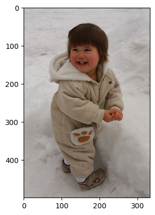
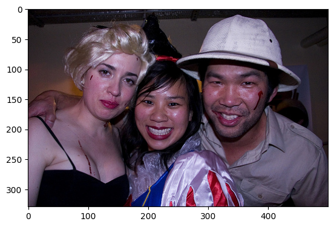
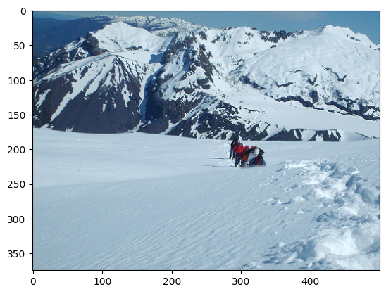
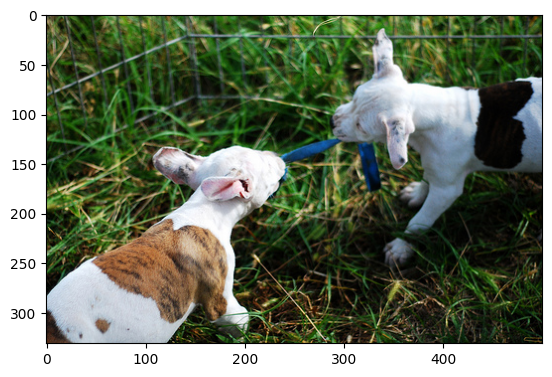
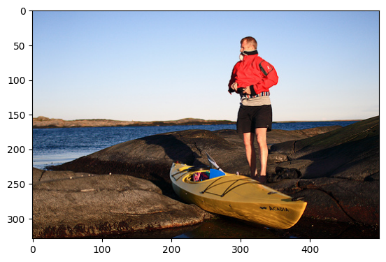
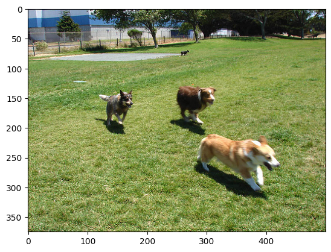
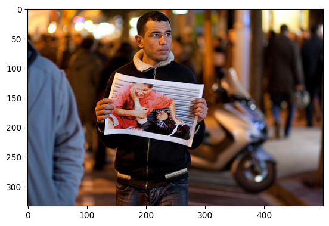
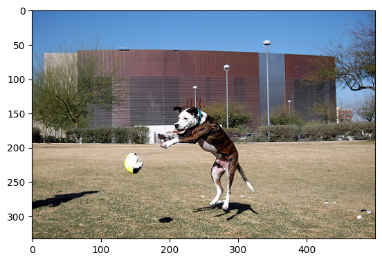

# Image Caption Generation

This project focuses on generating captions for images using a combination of a pre-trained EfficientNetV2M model for image encoding and an LSTM-based decoder for generating captions.

## Overview

- **Data Augmentation**: Applied to images before sending them to the encoder.
- **Vocabulary Building**: Built using training captions with a specified vocabulary size and frequency threshold.
- **Image Encoding**: Used a pre-trained EfficientNetV2M model to encode images.
- **Caption Generation**: Used LSTM decoder, trained with encoded images and corresponding captions.

## Dataset

- **Dataset Used**: Flickr8k
- **Vocabulary Size**: 20,000
- **Threshold Frequency**: 5
- **Batch Size**: 16

## Project Structure

- **cnn_lstm.ipynb**: Contains the code for creating the vocabulary and the Encoder-Decoder architecture.
- **kaggle_dl.ipynb**: We use Kaggle's GPU resources to train the model. This notebook shows the training process using Kaggle's platform and displays generated captions for random images after 10, 20, 30, and 40 epochs.

## Methodology

1. **Data Augmentation**:
   - Performed on images to improve the robustness of the model.

2. **Vocabulary Creation**:
   - Built a vocabulary class to numericalize and denumericalize captions.
   - Only included words that appeared at least 5 times in the training captions.

3. **Image Encoding**:
   - Used EfficientNetV2M as the encoder.
   - Extracted feature vectors from the images.

4. **Caption Generation**:
   - Used LSTM to decode the encoded image features along with the numericalized captions.
   - During inference, the embedded image feature vector is fed into the LSTM.
   - The output from the LSTM is recursively used as input to the next LSTM cell to generate captions sequentially.

## Training

- **Training Process**:
  - Encoded images and numericalized captions are used as inputs to the LSTM decoder.
  - The model is trained to generate captions word-by-word.

- **Evaluation**:
  - In the `kaggle_dl.ipynb` file, captions generated for random images are displayed after 10, 20, 30, and 40 epochs to show the progression of the model's learning.

## Results 
### Images and Captions after 10 Epochs

\
*Original Caption:* A toddler in a beige suit is smiling whilst playing in the snow .\
*Predicted Caption:* <SOS> a little girl in a pink dress is running on a field . <EOS>

\
*Original Caption:* The man wears a white hat and poses with a blonde woman and a black haired woman .\
*Predicted Caption:* <SOS> a man and a woman are sitting on a bench . <EOS>

### Images and Captions after 20 Epochs

\
*Original Caption:* A group of mountain climbers .\
*Predicted Caption:* <SOS> a snowboarder is in the air over a snowy hill . <EOS>

\
*Original Caption:* Two brown and white puppies are playing tug of war with a blue strip of fabric .\
*Predicted Caption:* <SOS> a dog is running through the grass . <EOS>

### Images and Captions after 30 Epochs

\
*Original Caption:* A man wearing a red jacket standing beside a yellow canoe on some rocks with water in the background .\
*Predicted Caption:* <SOS> a man is standing on the beach by the ocean . <EOS>

\
*Original Caption:* three dogs are running across the grass near to a blue industrial building .\
*Predicted Caption:* <SOS> a dog is running through the grass . <EOS>

### Images and Captions after 40 Epochs

\
*Original Caption:* A man is standing in front of a motor-scooter holding up a picture .\
*Predicted Caption:* <SOS> a man in a black jacket is standing in front of a white brick building . <EOS>

\
*Original Caption:* A dog jumps to catch a ball in a large field .\
*Predicted Caption:* <SOS> a dog jumps over a hurdle . <EOS>

## Conclusion

This project demonstrates the process of image caption generation using a combination of EfficientNetV2M for image encoding and LSTM for caption generation. The generated captions improve as the training progresses, highlighting the effectiveness of the Encoder-Decoder architecture for this task.

